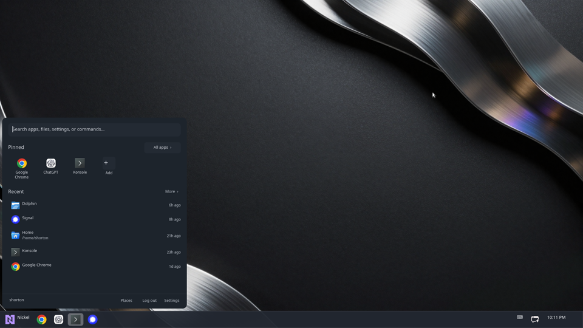

# Nickel

**One desktop for Windows and Linux, with a shell you can change while you use
it.** Nickel brings its own desktop, taskbar or dock, launcher, task switching,
system controls, controller navigation, and apps.

**Powered by JavaScript, best-in-class DX, and cross-platform.** The production
shell is composed from capability-constrained JSX components and rendered by
Nickel—not a browser. On Linux, Nickel can also run as a Wayland compositor.

[](assets/screenshots/nickel-default-shell.png)

*That's Nickel. It looks like that on Windows. It looks like that on Linux.*

**Windows without Explorer, including UWP apps.** Nickel is the first
independent Windows shell to run UWP apps without keeping Explorer alive. It
does this through the
[Universal Windows Usher](crates/nickel-uwu/README.md)—UwU for short—which
recreates the Windows shell services those applications expect.

Nickel is the desktop, its Settings are part of the active shell, and File is
called File because even we have limits.

## Try it

Build Nickel with stable Rust. Run commands from the repository root.

### Windows

```powershell
cargo run -p nickel
```

This starts Nickel beside your current Windows desktop. When Nickel is installed
as the shell and owns the Windows shell window, it starts UwU automatically. If
Explorer is still registered, Nickel politely shares the session instead of
replacing it. See the
[UwU research notes](crates/nickel-uwu/README.md) for the implementation,
diagnostic commands, and the underlying COM research.

Tagged releases include a per-user x86-64 MSI. Its optional **Make Nickel the default shell**
feature is disabled by default; selecting it starts Nickel instead of Explorer at the next sign-in.
Removing the feature or uninstalling Nickel restores the normal Windows shell fallback. See the
[Windows installer notes](packaging/windows/README.md) for packaging and native acceptance details.

### Linux nested session

Run Nickel inside an existing Linux desktop, like a desktop-shaped ship in a
desktop-shaped bottle:

```bash
cargo run -p nickel --no-default-features --features backend-winit --bin nickel-nested
```

The nested session runs the same JSX-driven shell as a real session. To work on
an isolated package with live reload, use the
[`nickel-plugin` development workflow](assets/plugins/README.md).

For a direct DRM/udev session or an SDDM login session, see
[Linux sessions](docs/linux-sessions.md). The direct session is still under
development.

## Features

- A GPU-rendered desktop with a selectable JSX shell, native icons, previews,
  application grouping, and task switching.
- An application launcher with fuzzy search, pinned apps, and launch history.
- Two bundled shells: the production default Nickel taskbar and an experimental
  Cupertino-style floating dock.
- Controller navigation with PlayStation, Xbox, Switch, and generic gamepads.
  Confirm and cancel follow the controller family, because muscle memory is a
  user interface contract.
- Shell-owned Settings, Quick Settings, notifications, window menus, Run, the
  volume OSD, and the on-screen keyboard, backed by native capabilities.
- Nickel File, a Markdown viewer, a terminal, and a Codex chat application.
- A shared shell experience on Windows and Linux, including a Wayland
  compositor on Linux.

## Shells and themes

Nickel ships a production default shell and an experimental derived theme:

- **Nickel Default Shell** supplies the taskbar, launcher, Settings, Quick
  Settings, notifications, window controls, previews, and companion surfaces.
- **Nickel Cupertino Dock (experimental)** inherits the default shell and
  replaces its taskbar with a centered floating dock, while retaining the rest
  of the default experience. Its animated dock is still being optimized and can
  feel sluggish today.

Choose the active shell from the Plugins page in Settings. Shells are ordinary,
versioned packages: they can export and replace components, declare their native
surfaces, and request only the capabilities they need. The bundled shells live
in [`assets/plugins`](assets/plugins/), alongside examples and package tooling.

The visible shell is powered by JavaScript, but it is not Electron or a web
view. Nickel executes generated JavaScript in a bounded package runtime and
translates its component tree into native layout and drawing. The native host
keeps input, hit testing, effects, protected data, and platform access under its
control.

## Architecture

Rust crates own portable application state, search, ranking, navigation,
rendering, package validation, and capability enforcement. The selected JSX
shell owns presentation and composes those native facilities into the visible
desktop. Narrow adapters connect the shared behavior to Windows APIs or to
Nickel's Linux compositor.

This division keeps policy deterministic and testable, lets shells change
without duplicating platform integrations, and ensures package code cannot
bypass native authority checks.

See the [Cargo workspace guide](docs/cargo-workspace.md) for the crate map and
responsibilities.

## Keyboard and mouse

| Input | Action |
| --- | --- |
| `Windows` | Open or close the launcher |
| `Windows` + `R` | Open Run |
| `Alt` + `Tab` | Switch windows |
| `Alt` + `` ` `` | Cycle windows in the current application |
| `Windows` + `E` | Open Nickel File on Windows |
| `Windows` + left-drag | Move a window |
| `Windows` + right-drag | Resize a window |

The launcher also supports arrow-key navigation, `Enter` to launch, and
`Escape` to close the active Nickel surface.

### Controller

| Controller input | Action |
| --- | --- |
| D-pad or left stick | Navigate |
| South face button | Confirm |
| East face button or Select | Cancel |
| Start | Open the context menu |
| Left or right shoulder | Switch panes |
| Guide | Open or close the launcher |

Nintendo layouts use the east face button to confirm and the south face button
to cancel. Nickel detects the controller family instead of asking a Switch
owner to pretend the letters are in Xbox places.

## Project status

Nickel is under active development, but the JSX shell path and default shell are
production—not an experiment or a preview architecture. The derived Cupertino
dock uses those same package, composition, rendering, and capability paths, but
the theme itself remains experimental while its animation performance is
improved.

The desktop, launcher, Settings, task switching, controller navigation, and
bundled applications are usable today. Work remains across platform coverage,
accessibility, hardware integration, and the direct Linux session.

## Further reading

- [Linux sessions](docs/linux-sessions.md) — nested, direct, and login-session
  setup and diagnostics.
- [UwU research notes](crates/nickel-uwu/README.md) — Windows UWP discovery,
  experiments, and diagnostics.
- [Codex backend diagnostics](docs/codex-backend-diagnostics.md) — offline
  replay and backend tests.
- [Plugin and shell packages](assets/plugins/README.md) — package validation,
  development, composition, and examples.
- [Default shell package](assets/plugins/nickel-default/README.md) — the stock
  JSX shell and its public component contracts.
- [Cupertino Dock](assets/plugins/nickel-cupertino-dock/README.md) — the bundled
  experimental theme and live-preview workflow.
- [Active specifications](specs/) and [completed specifications](specs/done/).

## Contributing

Before submitting a change, run the usual three Cargo checks:

```bash
cargo fmt --all --check
cargo clippy --workspace --all-targets --all-features -- -D warnings
cargo test --workspace
```

Include behavior tests where practical and record the platforms tested. “It
worked on my machine” is useful evidence once you tell us which machine.

## License

Copyright 2026 Steven Horton.

Nickel is dual-licensed under the [MIT License](LICENSE-MIT) or the
[Apache License, Version 2.0](LICENSE-APACHE), at your option.

## Similar projects

- [Cairo Shell](https://github.com/cairoshell/cairoshell) - the most popular alternative shell
- [GyroShell](https://github.com/Pdawg-bytes/GyroShell)
